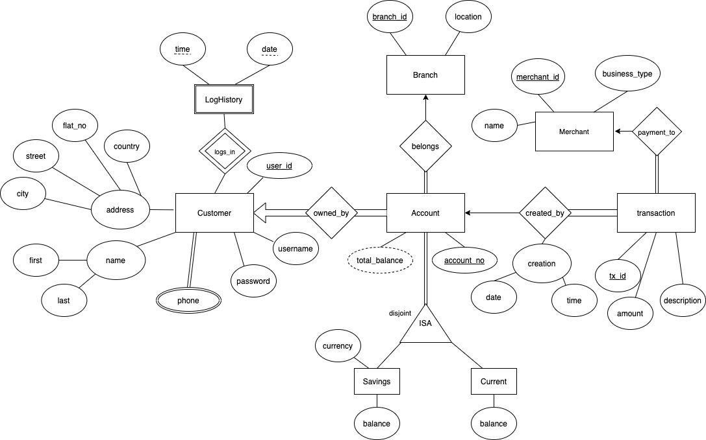

# Face Recognition

Face recognition using Python and MySQL, using Flask as a web framework

*******

## Setup and launch

### Source files
1. Download and unzip the source files
2. Launch terminal and change directory into the new folder

### MySQL Database setup
3. Access mySQL database locally (using `mysql -u root -p`)
4. Enter the password
5. Enter the following commands:
```
CREATE DATABASE facerecognition;
USE facerecognition;
source facerecognition.sql
```
### .env File
5. Duplicate the .env.template file
6. Enter this new file and fill in the all of the details. 

Note: `MYSQL_HOST` is likely to be `'localhost'` and `MYSQL_DB` must be `'facerecognition'`

7. Rename this file to `.env`

### Environment
8. Enter the following commands. Note that the `x` must be replaced in `python=3.x`
```
conda create -n face python=3.x
conda activate face
pip install -r requirements.txt
```
### Run
9. Switch to folder with unzipped files
10. Enter `python backend.py`
11. Go to `http://127.0.0.1:5000/`

## Usage
### Functionality
- Face ID login: Users can train a model to recognize their face and then use the Face ID login option
- View and filter transactions: Transactions of users can be filtered based on account, date, time and amount
- View account balances and details: Users can view their account balances 
- [EXTRA feature] Sign-up: New users can enter their details and gain access to the app
- [EXTRA feature] Change account details: All users can change their account details like phone number, password and address information

### Sign-up
1. From the homepage, new users can sign up by clicking `Register here`
2. Fill in all the fields (Note: Full name must include first and last name, and first names should be unique for all users)
3. The application will automatically capture your face for the Face ID login feature

### Log-in
#### Option 1: Email and password
From the home page, you can enter a valid email and password combination to login. (refer to the Customer table in MySQL for login IDs)
#### Option 2: Face ID
You can also use your face ID to login. However, your face must have been captured and the data must have been trained beforehand. 

### Using Existing User
When signing up as new users, there will be no accounts or transactions to display. Instead, you may use an existing users' account, which have a database of transactions, accounts and profile information. Follow the following steps:

1. Run `python face_capture.py` to capture your face
2. Run `python train.py` to train the model
3. Run `python backend.py` to launch the app
4. Login with Face ID
5. You should login as `Aayush Batwara`

## ER Diagram



